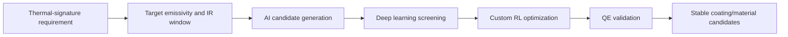
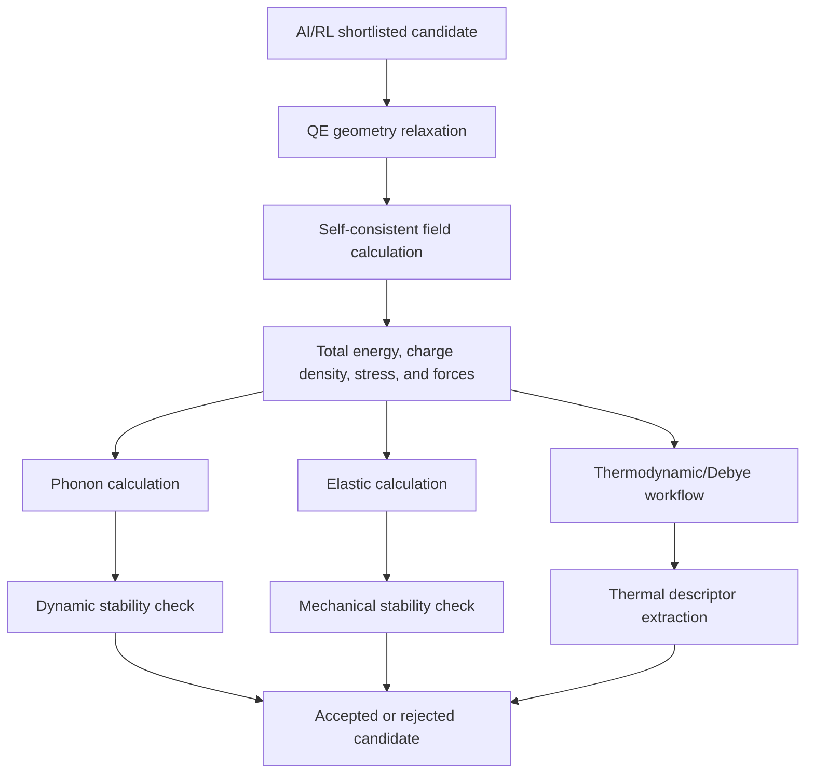
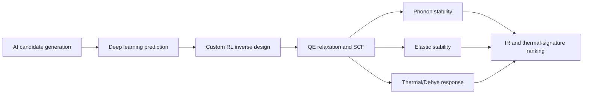

# Novyte Materials AI/ML-DFT Materials Discovery Proof Package

This repository contains a compact, non-confidential proof package for Novyte Materials' completed AI/ML-assisted materials discovery run with first-principles validation.

The work directly aligns with DRDO's requested direction: AI/ML-based material development for concealment of objects through thermal signature reduction, infrared-response control, emissivity-aware coating design, and DFT-validated inverse material discovery.

## Positioning For DRDO

Novyte Materials has completed a working computational materials-discovery chain that combines custom RL, deep learning models, and Quantum ESPRESSO DFT validation. The included evidence is intended to show that the workflow has already been executed: candidates were generated, QE jobs were prepared and run, and stability/thermal artifacts were produced for reviewer inspection.

For the requested defence application, the same chain is positioned toward low-observable material and coating development:

## What Novyte Materials Has Demonstrated

| DRDO requested area | Demonstrated Novyte capability |
|---|---|
| Thermal signature reduction | Computational ranking of materials using thermal-response descriptors, stability gates, Debye/thermodynamic outputs, and coating-relevance scores. |
| Infrared camouflage materials/coatings | Extension-ready objective functions for emissivity, spectral IR response, absorptivity, reflectivity, and low-signature coating selection. |
| Emissivity prediction and optimization | Custom deep learning property models and reward-driven inverse search objective for target emissivity windows. |
| AI/ML-based material discovery | Discrete candidate generation, descriptor construction, deep learning prediction, custom RL exploration, and DFT confirmation. |
| Multispectral camouflage technologies | Generalized scoring layer that can combine thermal, IR, mechanical, optical, and processability constraints. |
| Validated computation | Quantum ESPRESSO relaxation, SCF, phonon, elastic, and thermal/Debye run evidence is included in `run_evidence/`. |

## End-To-End Workflow

```mermaid
flowchart LR
    A["Defence application target"] --> B["Thermal and IR property targets"]
    B --> C["Discrete material candidate space"]
    C --> D["Descriptor vector construction"]
    D --> E["Deep learning property models"]
    E --> F["Custom RL inverse search"]
    F --> G["Shortlisted candidate materials"]
    G --> H["Quantum ESPRESSO DFT validation"]
    H --> I["Phonon, elastic, and thermal checks"]
    I --> J["Coating and IR-response ranking"]
    J --> K["Validated material recommendations"]
```

The important point is that the workflow is not only a concept. The repository includes actual run traces: QE input decks, output logs, phonon dynamical-matrix files, elastic output files, and thermal plot artifacts.

## Mathematical Core

### 1. Discrete Material Representation

Each candidate material is represented as a finite design object:

$$
m = (E, n, q, c, s)
$$

where:

$$
E = \{e_1,e_2,\ldots,e_K\}
$$

$$
n = [n_1,n_2,\ldots,n_K], \qquad q = [q_1,q_2,\ldots,q_K]
$$

`E` is the element set, `n` is the stoichiometric count vector, `q` is the charge-state vector, `c` is the structural class, and `s` is the application state such as bulk, thin-film, coating, or composite layer.

The inverse design task is:

$$
m^* = \arg\min_{m \in M} J_{\mathrm{total}}(m)
$$

subject to chemical validity, DFT stability, thermal-response suitability, mechanical robustness, and coating-process feasibility.

### 2. Chemical Validity Gate

Formal charge balance is enforced before high-cost computation:

$$
Q(m) = \sum_i n_i q_i
$$

$$
Q(m) = 0
$$

For ranking and learning:

$$
P_{\mathrm{charge}}(m) = \alpha_Q Q(m)^2
$$

This gate prevents the AI model from spending DFT resources on chemically invalid candidates.

### 3. Descriptor Tensor For Deep Learning

Every material is converted into a numerical feature vector:

$$
x(m) = \phi(m)
$$

with descriptor blocks:

$$
x(m) =
[
x_{\mathrm{comp}},
x_{\mathrm{charge}},
x_{\mathrm{radius}},
x_{\mathrm{packing}},
x_{\mathrm{coord}},
x_{\mathrm{bond}},
x_{\mathrm{thermal}},
x_{\mathrm{DFT}}
]
$$

Weighted elemental statistics are computed as:

$$
\bar{p}(m) = \frac{\sum_i n_i p_i}{\sum_i n_i}
$$

$$
\sigma_p^2(m) = \frac{\sum_i n_i(p_i-\bar{p})^2}{\sum_i n_i}
$$

These terms allow the models to learn chemical contrast, size mismatch, bonding character, and likely stability trends.

### 4. Deep Learning Property Model

The property model maps descriptors to predicted material behavior:

$$
\hat{y}(m) = f_{\theta}(x(m))
$$

where:

$$
\hat{y}(m) =
[
\hat{E}_{\mathrm{form}},
\hat{E}_{\mathrm{hull}},
\hat{S}_{\mathrm{stability}},
\hat{\omega}_{\min},
\hat{C}_{\mathrm{stable}},
\hat{\Theta}_D,
\hat{S}_{\mathrm{thermal}},
\hat{S}_{\mathrm{IR}}
]
$$

This lets the workflow rapidly prioritize candidates before launching the more expensive QE calculations.

### 5. Custom RL Inverse Search

The inverse design loop is framed as a sequential decision process:

$$
s_t = [m_t, x(m_t), \hat{y}(m_t), g]
$$

where `g` is the target property profile for low thermal signature and controlled IR response.

The policy selects a discrete material-editing action:

$$
a_t \sim \pi_{\psi}(a_t \mid s_t)
$$

Candidate transitions are:

$$
m_{t+1} = T(m_t,a_t)
$$

with actions such as element substitution, stoichiometry adjustment, structural-class selection, coating-state selection, and constraint repair.

The reward is:

$$
R(m) =
w_{\mathrm{IR}}S_{\mathrm{IR}}(m)
+ w_{\mathrm{thermal}}S_{\mathrm{thermal}}(m)
+ w_{\mathrm{DFT}}S_{\mathrm{DFT}}(m)
+ w_{\mathrm{mech}}S_{\mathrm{mech}}(m)
- P_{\mathrm{invalid}}(m)
$$

The RL objective is:

$$
\max_{\psi}\; \mathbb{E}_{\pi_{\psi}}
\left[
\sum_{t=0}^{T} \gamma^t R(m_t)
\right]
$$

This is the core AI engine that moves the workflow from screening to inverse design.

## Thermal And IR Objective

For concealment-oriented material development, the optimization target is expressed as:

$$
\epsilon_{\lambda}(\theta,T)
=
1 - R_{\lambda}(\theta,T) - T_{\lambda}(\theta,T)
$$

For optically opaque coating layers:

$$
T_{\lambda} \approx 0
\qquad \Rightarrow \qquad
\epsilon_{\lambda} \approx A_{\lambda} = 1 - R_{\lambda}
$$

The spectral radiance objective is tied to emitted thermal power:

$$
M_{\lambda}(T) =
\epsilon_{\lambda}(T)M_{\lambda}^{\mathrm{bb}}(T)
$$

where lower or controlled `epsilon_lambda` in the target band reduces the observable thermal signature against a chosen background.

$$
J_{\mathrm{IR}}(m) =
w_{\epsilon}\left|\epsilon_{\lambda}(m)-\epsilon_{\lambda}^{\mathrm{target}}\right|
+ w_R\left|R_{\lambda}(m)-R_{\lambda}^{\mathrm{target}}\right|
+ w_A\left|A_{\lambda}(m)-A_{\lambda}^{\mathrm{target}}\right|
$$

The thermal component is:

$$
J_{\mathrm{thermal}}(m) =
w_k\left|k(m)-k^{\mathrm{target}}\right|
+ w_C\left|C_v(m)-C_v^{\mathrm{target}}\right|
+ w_{\Theta}\left|\Theta_D(m)-\Theta_D^{\mathrm{target}}\right|
$$

The final score combines performance and feasibility:

$$
J_{\mathrm{total}}(m) =
J_{\mathrm{IR}}(m)
+ J_{\mathrm{thermal}}(m)
+ J_{\mathrm{DFT}}(m)
+ J_{\mathrm{mech}}(m)
+ J_{\mathrm{process}}(m)
$$

Accepted candidates must satisfy:

$$
\omega_{\min}(m) \ge 0,
\qquad C(m) \succ 0,
\qquad F_{\max} < F_{\mathrm{tol}},
\qquad |\sigma| < \sigma_{\mathrm{tol}}
$$

This gives a direct mathematical bridge from AI search to emissivity and thermal-signature reduction.

## Quantum ESPRESSO Validation Ladder

The first-principles layer is based on the Kohn-Sham DFT problem:

$$
\left[
-\frac{1}{2}\nabla^2
+ V_{\mathrm{eff}}[n](r)
\right]\psi_i(r)
=
\epsilon_i \psi_i(r)
$$

with electron density:

$$
n(r) = \sum_i f_i |\psi_i(r)|^2
$$

Geometry optimization minimizes:

$$
E_{\mathrm{DFT}}(R) =
E_{\mathrm{kin}}
+ E_{\mathrm{ion}}
+ E_{\mathrm{H}}
+ E_{\mathrm{xc}}
$$

until:

$$
\left|\frac{\partial E_{\mathrm{DFT}}}{\partial R_i}\right| < F_{\mathrm{tol}}
$$

and:

$$
|\sigma_{\alpha\beta}| < \sigma_{\mathrm{tol}}
$$

Candidate stability can be summarized through the DFT formation-energy form:

$$
E_{\mathrm{form}}(m)
=
\frac{
E_{\mathrm{DFT}}(m) - \sum_i n_i \mu_i
}{
\sum_i n_i
}
$$

where `mu_i` is the reference chemical potential for constituent species. This links the AI-ranked candidate to an explicit first-principles energetic check.

Phonon stability is checked through the dynamical matrix:

$$
D_{\alpha\beta}^{ij}(q) =
\frac{1}{\sqrt{M_iM_j}}
\sum_R
\Phi_{\alpha\beta}^{ij}(R)
e^{iq \cdot R}
$$

Accepted dynamically stable candidates satisfy:

$$
\omega^2(q) \ge 0
$$

for the validated phonon modes.

Elastic stability is checked using the elastic tensor:

$$
C_{ij} = \frac{\partial \sigma_i}{\partial \epsilon_j}
$$

and the mechanical stability condition:

$$
C \succ 0
$$

Thermodynamic behavior is captured using Debye-linked quantities:

$$
C_v(T) =
9Nk_B
\left(\frac{T}{\Theta_D}\right)^3
\int_0^{\Theta_D/T}
\frac{x^4e^x}{(e^x-1)^2}\,dx
$$

These quantities support ranking for thermal response, coating suitability, and low-signature material development.

## What The Included Run Evidence Shows

| Evidence type | File examples | Technical meaning |
|---|---|---|
| Structure and relaxation inputs | `geo.in`, `input_tmp.in` | Candidate structures were prepared for first-principles calculation. |
| SCF inputs and outputs | `scf.in`, `scf.out` | Electronic ground-state calculations were executed. |
| Phonon inputs and outputs | `ph.in`, `ph.out`, `.dynG` | Dynamic stability workflow was run and phonon artifacts were generated. |
| Elastic calculations | `elastic.in`, `elastic.out` | Mechanical-response and elastic stability workflow was run. |
| Thermal/Debye outputs | `thermo_control`, `output_therm_debye.g1.ps`, `output_therm_debye.g1.png` | Thermal-property workflow artifacts were generated. |
| Equation-of-state plots | `output_mur.ps` | Energy-volume fitting and related post-processing were performed. |

## Repository Contents

- `docs/Novyte_Materials_DRDO_Technical_Brief.md`
  Short non-confidential technical brief prepared for DRDO-style technical assessment.

- `docs/Novyte_AI_ML_DFT_Inverse_Materials_Workflow.md`
  Expanded workflow note explaining the algebraic objective functions, inverse-design loop, DFT validation ladder, and extension to emissivity/IR-response optimization.

- `docs/Novyte_Materials_Discrete_Methodology_Math.md`
  Detailed discrete methodology with mathematical formulation for candidate generation, custom RL search, deep learning property prediction, DFT validation, thermal/IR objectives, and final material ranking.

- `docs/RUN_EVIDENCE_MANIFEST.md`
  Explanation of what the run evidence proves and what heavy scratch data was intentionally excluded.

- `run_evidence/`
  Lightweight Quantum ESPRESSO and post-processing run evidence. Heavy scratch files, wavefunctions, charge-density files, temporary restart folders, and cache artifacts are intentionally excluded.

## Reviewer Takeaway

Novyte Materials has already demonstrated the full computational chain needed for AI/ML-enabled materials discovery with DFT validation:

This package is intended as proof of computational capability and run traceability without exposing confidential source material.
