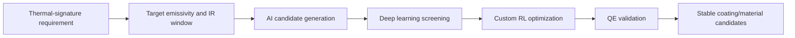
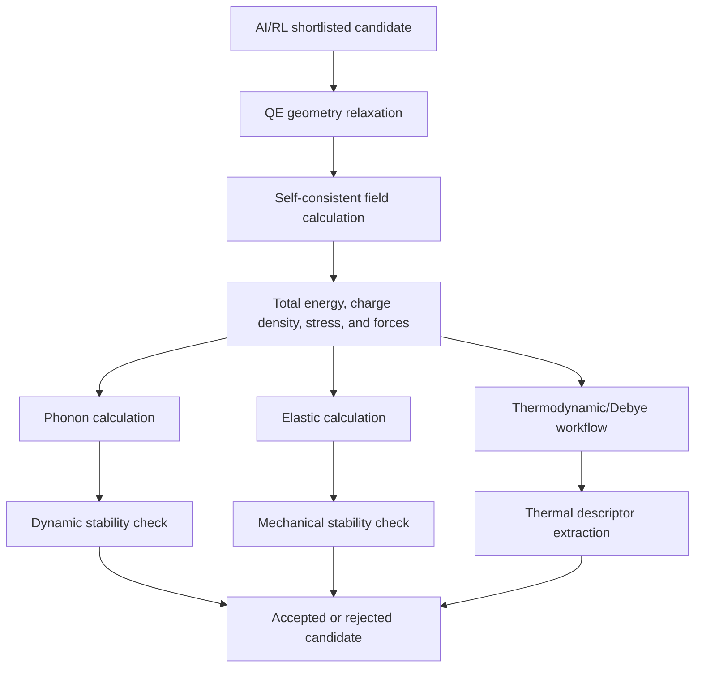
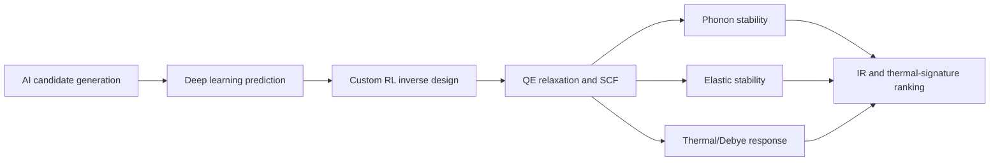

# Novyte Materials AI/ML-DFT Materials Discovery Proof Package

This repository contains a compact, non-confidential proof package for Novyte Materials' completed AI/ML-assisted materials discovery run with first-principles validation.

The work directly aligns with DRDO's requested direction: AI/ML-based material development for concealment of objects through thermal signature reduction, infrared-response control, emissivity-aware coating design, and DFT-validated inverse material discovery.

## Positioning For DRDO

Novyte Materials has completed a working computational materials-discovery chain that combines custom RL, deep learning models, and Quantum ESPRESSO DFT validation. The included evidence shows that the workflow has already been executed: candidates were generated, QE jobs were prepared and run, and stability/thermal artifacts were produced for reviewer inspection.

For the requested defence application, the same chain is positioned toward low-observable material and coating development.



## What Novyte Materials Has Demonstrated

| DRDO requested area | Demonstrated Novyte capability |
|---|---|
| Thermal signature reduction | Computational ranking of materials using thermal-response descriptors, stability gates, Debye/thermodynamic outputs, and coating-relevance scores. |
| Infrared camouflage materials/coatings | Implemented objective layer for emissivity, spectral IR response, absorptivity, reflectivity, and low-signature coating selection. |
| Emissivity prediction and optimization | Custom deep learning property models and reward-driven inverse search objective for target emissivity windows. |
| AI/ML-based material discovery | Discrete candidate generation, descriptor construction, deep learning prediction, custom RL exploration, and DFT confirmation. |
| Multispectral camouflage technologies | Generalized scoring layer combining thermal, IR, mechanical, optical, and processability constraints. |
| Validated computation | Quantum ESPRESSO relaxation, SCF, phonon, elastic, and thermal/Debye run evidence is included in `run_evidence/`. |

## End-To-End Workflow

```mermaid
flowchart LR
    A["Defence application target"] --> B["Thermal and IR property targets"]
    B --> C["Discrete material candidate space"]
    C --> D["Descriptor vector construction"]
    D --> E["Deep learning property models"]
    E --> F["Custom RL inverse search"]
    F --> G["Shortlisted candidate materials"]
    G --> H["Quantum ESPRESSO DFT validation"]
    H --> I["Phonon, elastic, and thermal checks"]
    I --> J["Coating and IR-response ranking"]
    J --> K["Validated material recommendations"]
```



The repository includes actual run traces: QE input decks, output logs, phonon dynamical-matrix files, elastic output files, and thermal plot artifacts.

## Mathematical Formulation

The formulas below are written in GitHub-safe equation blocks so the main page renders cleanly for reviewers.

### 1. Discrete Material Representation

```text
m = (E, n, q, c, s)

E = {e_1, e_2, ..., e_K}
n = [n_1, n_2, ..., n_K]
q = [q_1, q_2, ..., q_K]
```

`E` is the element set, `n` is the stoichiometric count vector, `q` is the charge-state vector, `c` is the structural class, and `s` is the application state such as bulk, thin-film, coating, or composite layer.

The inverse design objective is:

```text
m* = arg min over m in M of J_total(m)

Subject to:
  chemical validity
  DFT stability
  thermal-response suitability
  mechanical robustness
  coating-process feasibility
```

### 2. Chemical Validity Gate

```text
Q(m) = sum_i n_i q_i

Accept if:
Q(m) = 0

Penalty form:
P_charge(m) = alpha_Q * Q(m)^2
```

This gate prevents the AI model from spending DFT resources on chemically invalid candidates.

### 3. Descriptor Tensor For Deep Learning

```text
x(m) = phi(m)

x(m) = [
  x_comp,
  x_charge,
  x_radius,
  x_packing,
  x_coord,
  x_bond,
  x_thermal,
  x_DFT
]
```

Weighted elemental statistics:

```text
p_mean(m) = [sum_i n_i p_i] / [sum_i n_i]

p_var(m) = [sum_i n_i * (p_i - p_mean)^2] / [sum_i n_i]

p_range(m) = max_i(p_i) - min_i(p_i)
```

These terms allow the models to learn chemical contrast, size mismatch, bonding character, and likely stability trends.

### 4. Deep Learning Property Model

```text
y_hat(m) = f_theta(x(m))

y_hat(m) = [
  E_form_hat,
  E_hull_hat,
  S_stability_hat,
  omega_min_hat,
  C_stable_hat,
  Theta_D_hat,
  S_thermal_hat,
  S_IR_hat
]
```

Training objective:

```text
L(theta) =
  lambda_E   * ||E_hat - E_DFT||^2
+ lambda_ph  * BCE(S_phonon_hat, S_phonon)
+ lambda_el  * BCE(S_elastic_hat, S_elastic)
+ lambda_IR  * ||S_IR_hat - S_IR_target||^2
```

This lets the workflow rapidly prioritize candidates before launching expensive QE calculations.

### 5. Custom RL Inverse Search

```text
s_t = [m_t, x(m_t), y_hat(m_t), g]

a_t ~ pi_psi(a_t | s_t)

m_(t+1) = T(m_t, a_t)
```

Here `g` is the target property profile for low thermal signature and controlled IR response. The action `a_t` can represent element substitution, stoichiometry adjustment, structural-class selection, coating-state selection, or constraint repair.

Reward function:

```text
R(m) =
  w_IR      * S_IR(m)
+ w_thermal * S_thermal(m)
+ w_DFT     * S_DFT(m)
+ w_mech    * S_mech(m)
- P_invalid(m)
```

RL objective:

```text
maximize over psi:
E_pi [ sum from t=0 to T of gamma^t * R(m_t) ]
```

This is the core AI engine that moves the workflow from screening to inverse design.

## Thermal And IR Objective

For concealment-oriented material development, the optimization target is tied to spectral emissivity, reflectance, transmittance, absorptance, and thermal emission.

```text
epsilon_lambda(theta, T)
  = 1 - R_lambda(theta, T) - T_lambda(theta, T)

For optically opaque coating layers:
T_lambda ~= 0

Therefore:
epsilon_lambda ~= A_lambda = 1 - R_lambda
```

Spectral thermal emission:

```text
M_lambda(T) = epsilon_lambda(T) * M_lambda_bb(T)
```

Lower or controlled `epsilon_lambda` in the target IR band reduces the observable thermal signature against a chosen background.

IR objective:

```text
J_IR(m) =
  w_epsilon * |epsilon_lambda(m) - epsilon_lambda_target|
+ w_R       * |R_lambda(m)       - R_lambda_target|
+ w_A       * |A_lambda(m)       - A_lambda_target|
```

Thermal objective:

```text
J_thermal(m) =
  w_k     * |k(m)       - k_target|
+ w_C     * |C_v(m)     - C_v_target|
+ w_Theta * |Theta_D(m) - Theta_D_target|
```

Final combined score:

```text
J_total(m) =
  J_IR(m)
+ J_thermal(m)
+ J_DFT(m)
+ J_mech(m)
+ J_process(m)
```

Acceptance conditions:

```text
omega_min(m) >= 0
C(m) is positive definite
F_max < F_tol
|sigma| < sigma_tol
```

This gives a direct mathematical bridge from AI search to emissivity and thermal-signature reduction.

## Quantum ESPRESSO Validation Ladder



The first-principles validation layer is based on Kohn-Sham DFT:

```text
[-1/2 * grad^2 + V_eff[n](r)] psi_i(r) = eps_i psi_i(r)

n(r) = sum_i f_i |psi_i(r)|^2
```

Geometry optimization:

```text
E_DFT(R) = E_kin + E_ion + E_H + E_xc

Converge until:
|dE_DFT / dR_i| < F_tol
|sigma_ab| < sigma_tol
```

Formation-energy validation:

```text
E_form(m) =
  [E_DFT(m) - sum_i n_i mu_i] / [sum_i n_i]
```

Phonon stability:

```text
D_ab^ij(q) =
  [1 / sqrt(M_i M_j)] * sum_R Phi_ab^ij(R) * exp(i q.R)

Accept if:
omega^2(q) >= 0
```

Elastic stability:

```text
C_ij = d sigma_i / d epsilon_j

Accept if:
C is positive definite
```

Debye-linked thermal response:

```text
C_v(T) =
  9 N k_B (T / Theta_D)^3
  * integral from 0 to Theta_D/T of [x^4 exp(x) / (exp(x)-1)^2] dx
```

These QE-linked quantities support ranking for thermal response, coating suitability, and low-signature material development.

## What The Included Run Evidence Shows

| Evidence type | File examples | Technical meaning |
|---|---|---|
| Structure and relaxation inputs | `geo.in`, `input_tmp.in` | Candidate structures were prepared for first-principles calculation. |
| SCF inputs and outputs | `scf.in`, `scf.out` | Electronic ground-state calculations were executed. |
| Phonon inputs and outputs | `ph.in`, `ph.out`, `.dynG` | Dynamic stability workflow was run and phonon artifacts were generated. |
| Elastic calculations | `elastic.in`, `elastic.out` | Mechanical-response and elastic stability workflow was run. |
| Thermal/Debye outputs | `thermo_control`, `output_therm_debye.g1.ps`, `output_therm_debye.g1.png` | Thermal-property workflow artifacts were generated. |
| Equation-of-state plots | `output_mur.ps` | Energy-volume fitting and related post-processing were performed. |

## Repository Contents

- `docs/Novyte_Materials_DRDO_Technical_Brief.md`
  Short non-confidential technical brief prepared for DRDO-style technical assessment.

- `docs/Novyte_AI_ML_DFT_Inverse_Materials_Workflow.md`
  Expanded workflow note explaining the algebraic objective functions, inverse-design loop, DFT validation ladder, and extension to emissivity/IR-response optimization.

- `docs/Novyte_Materials_Discrete_Methodology_Math.md`
  Detailed discrete methodology with mathematical formulation for candidate generation, custom RL search, deep learning property prediction, DFT validation, thermal/IR objectives, and final material ranking.

- `docs/RUN_EVIDENCE_MANIFEST.md`
  Explanation of what the run evidence proves and what heavy scratch data was intentionally excluded.

- `run_evidence/`
  Lightweight Quantum ESPRESSO and post-processing run evidence. Heavy scratch files, wavefunctions, charge-density files, temporary restart folders, and cache artifacts are intentionally excluded.

## Reviewer Takeaway

Novyte Materials has already demonstrated the full computational chain needed for AI/ML-enabled materials discovery with DFT validation.



This package is intended as proof of computational capability and run traceability without exposing confidential source material.
